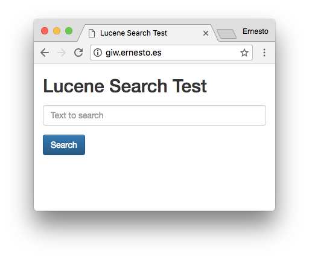

# Gestión de Información en la Web - Practica 3
> Ernesto Serrano Collado <erseco@correo.ugr.es> 74003802Z

### Máster Profesional en Ingeniería Informática (Universidad de Granada)

## Desarrollo de un Sistema de Recuperación de Información con Lucene

## Introducción

### Los objetivos de esta práctica son:

1. Conocer las partes principales que tiene un sistema de recuperación de información y qué funcionalidad tiene cada una.
2. Implementar un sistema de recuperación de información.
3. Emplear la biblioteca `Lucene` para facilitar dicha implementación.

### En esta práctica se construirá un sistema de recuperación de información empleando la biblioteca Lucene, compuesto de dos programas:

1. Un **indexador**, el cual recibirá como argumentos la ruta de la colección documental a indexar, el fichero de palabras vacías a emplear y la ruta donde alojar los índices, y llevará a cabo la indexación, creando los índices oportunos y ficheros auxiliares necesarios para la recuperación. Esta aplicación se ejecutará en la línea de mandatos y no tendrá ningún componente gráfico. Este software realizará las tareas de tokenización, eliminación de palabras vacías y extracción de raíces antes de crear el índice.
2. Un **motor de búsqueda**, que al ejecutarse recibirá como argumento la ruta donde está alojado el índice de la colección y permitirá que un usuario realice una consulta de texto y obtenga el conjunto de documentos relevantes a dicha consulta. En este caso, el programa sí será gráfico. Sobre la consulta se realizarán los mismos procesos que sobre los documentos en el indexador.

## Desarrollo

Para la realización de esta práctica se ha optado por utilizar el lenguaje de programación `Python` mediante la librería [`PyLucene`](http://lucene.apache.org/pylucene/). Dicha librería lo que hace es mediante `jcc` crear un envoltorio *(wrapper)* de `Lucene` que puede ser invocado desde `Python`. La librería `PyLucene` no es un desarrollo tan activo y con tanta documentación como el propio `Lucene`por lo que para usar muchas cosas se ha tenido que indagar en el propio código fuente y a base de prueba y error.

### Instalación de PyLucene

Para el despliegue se ha provisionado una máquina Ubuntu 16.04 LTS en AWS.

#### Instalación de dependencias
```bash
sudo apt-get update
sudo apt-get install -y ant g++ python-dev python-setuptools python-pip default-jdk-headless
sudo pip install --upgrade pip
sudo pip install setuptools --upgrade
```

#### Descarga y extracción de `PyLucene`
```bash
wget http://apache.rediris.es/lucene/pylucene/pylucene-4.10.1-1-src.tar.gz
tar -zxvf pylucene-4.10.1-1-src.tar.gz
```

#### Compilación e instalación de `jcc`
```bash
cd pylucene-4.10.1-1/jcc
sed -i s/java-7-openjdk-amd64/java-8-openjdk-amd64/ setup.py
python setup.py build
sudo python setup.py install
cd ..
```

#### Edición del `Makefile` de `PyLucene`
```
# Linux     (Ubuntu 11.10 64-bit, Python 2.7.2, OpenJDK 1.7, setuptools 0.6.16)
# Be sure to also set JDK['linux2'] in jcc's setup.py to the JAVA_HOME value
# used below for ANT (and rebuild jcc after changing it).
PREFIX_PYTHON=/usr
ANT=JAVA_HOME=/usr/lib/jvm/java-8-openjdk-amd64 /usr/bin/ant
PYTHON=$(PREFIX_PYTHON)/bin/python
JCC=$(PYTHON) -m jcc --shared
NUM_FILES=8
```

#### Compilación e instalación de `PyLucene`
```bash
make
sudo make install
```

### Desarrollo de los programas requeridos

Se ha desarrollado un indexador básico utilizando la clase `SpanishAnalyzer`, el mayor problema encontrado a la hora de utilizar dicha clase ha sido para indicarle la lista de palabras a ignorar, ya que esperaba un tipo de dato especial, tras muchas pruebas se ha resuelto utilizando la clase `CharArraySet`.
Para parsear los ficheros XML se ha utilizado la librería `etree` [The ElementTree XML API](https://docs.python.org/2/library/xml.etree.elementtree.html) hacinedo uso de XPath para facilitar el extraer elementos del arbol DOM

Se ha desarrollado un motor de búsqueda que mediante el micro-framwework `Flask` expone una web que nos permite realizar búsquedas de una forma sencilla e intuitiva.





El código está disponible en
[GitHub](https://github.com/erseco/ugr_gestion_informacion_web/tree/master/p3/).

## Manual

### Indexador

Para realizar la indexación hay que ejecutar el programa `index.py` con los parámetros que exigen los requisitos de la práctica, se adjunta un ejemplo de como se debería de lanzar:

```bash
./indexer.py iniciativas08 palabras_vacias_utf8.txt index
```

>Si no se le especifican los parametros requeridos el programa mostrará un mensaje de ayuda.

### Motor de Búsqueda

Para lanzar el motor de búsqueda hay que ejecutar el programa `search.py` con los parámetros que exigen los requisitos de la práctica, se adjunta un ejemlo de como se debería de lanzar:
```bash
./search.py index
```
>Si no se le especifican los parametros requeridos el programa mostrará un mensaje de ayuda.

Una vez lanzado el programa podremos interactuar con el buscador entrando con el navegador en la url http://localhost:8080

## Bibliografía
- Documentación de Lucene: http://lucene.apache.org/
- Documentación de PyLucene: http://lucene.apache.org/pylucene/
- Documentación de XML Etree: https://docs.python.org/2/library/xml.etree.elementtree.html
- StackOverflow: https://stackoverflow.com/

## Anexos

### Código del indexador

```python
#!/usr/bin/env python

#-*- coding: utf-8 -*-

"""index.py: Indexer script using lucene."""

__author__      = "Ernesto Serrano"
__license__     = "GPL"
__version__     = "1.0.1"
__email__       = "erseco@correo.ugr.es"


import sys
import glob

from xml.etree import ElementTree as ET


import lucene

from java.io import File
from org.apache.lucene.analysis.es import SpanishAnalyzer
from org.apache.lucene.document import Document, Field
from org.apache.lucene.index import IndexWriter, IndexWriterConfig
from org.apache.lucene.store import SimpleFSDirectory
from org.apache.lucene.util import Version

from org.apache.lucene.analysis.util import CharArraySet

if __name__ == "__main__":

    if len(sys.argv) != 4:

        print sys.argv[0]+' <documentsDirectory> <stopWords> <indexDirectory>'
        exit()

    documentsDirectory=sys.argv[1]
    stopWords=sys.argv[2]
    indexDirectory=sys.argv[3]

    lucene.initVM()

    exclusionSet = CharArraySet(0, True)
    f = open(stopWords,'r')
    while 1:
        line = f.readline()
        if not line:break
        exclusionSet.add(line.strip())
    f.close()


    indexDir = SimpleFSDirectory(File(indexDirectory))


    writerConfig = IndexWriterConfig(SpanishAnalyzer(exclusionSet))

    writer = IndexWriter(indexDir, writerConfig)

    totalDocs = len(glob.glob(documentsDirectory+'/*.xml'))

    print "%d docs in index" % writer.numDocs()
    print "Reading %i from %s ..." % (totalDocs, documentsDirectory)

    i = 1

    for filename in glob.iglob(documentsDirectory+'/*.xml'):

        # print "Indexing %i of %i" % (i, totalDocs)

        sys.stdout.write("Indexing %i of %i\r" % (i, totalDocs))
        sys.stdout.flush()

        i += 1

        tree = ET.parse(filename)
        elements = tree.findall('.//parrafo')
        result = u" "
        for text in elements:
            # print(text.text)
            result += unicode(text.text) + " "
            # result.append(text.text + " ")


        doc = Document()

        doc.add(Field("filename", filename, Field.Store.YES, Field.Index.ANALYZED));
        doc.add(Field("text", result, Field.Store.YES, Field.Index.ANALYZED));

        # doc.add(Field("text", l, Field.Store.YES, Field.Index.ANALYZED))
        writer.addDocument(doc)
    print "Indexed %d lines from stdin (%d docs in index)" % (totalDocs, writer.numDocs())
    print "Closing index of %d docs..." % writer.numDocs()
    writer.close()

```

### Código del motor de búsqueda
```python
#!/usr/bin/env python

"""search.py: Search script for lucene index."""

__author__      = "Ernesto Serrano"
__license__     = "GPL"
__version__     = "1.0.1"
__email__       = "erseco@correo.ugr.es"

from flask import Flask, flash, render_template, request, redirect


import sys
import lucene

from java.io import File
from org.apache.lucene.analysis.standard import StandardAnalyzer
from org.apache.lucene.analysis.es import SpanishAnalyzer
from org.apache.lucene.document import Document, Field
from org.apache.lucene.search import IndexSearcher
from org.apache.lucene.index import IndexReader
from org.apache.lucene.queryparser.classic import QueryParser
from org.apache.lucene.store import SimpleFSDirectory
from org.apache.lucene.util import Version

from flask_table import Table, Col, LinkCol

from wtforms import Form, StringField, SelectField, validators


if len(sys.argv) != 2:

    print sys.argv[0]+' <indexDirectory>'
    exit()

indexDirectory=sys.argv[1]


app = Flask(__name__)
app.secret_key = "flask rocks!"


class SearchForm(Form):
    # choices = [('Artist', 'Artist'),
    #            ('Album', 'Album'),
    #            ('Publisher', 'Publisher')]
    # select = SelectField('Search for music:', choices=choices)
    search = StringField('')

class Results(Table):
    filename = Col('Filename')
    text = Col('Text')
    # link = LinkCol('Link', 'edit', url_kwargs=dict(id='filename'))

# Get some objects
class Row(object):
    def __init__(self, filename, text):
        self.filename = filename
        self.text = text

@app.route('/', methods=['GET', 'POST'])
def index():
    search = SearchForm(request.form)
    if request.method == 'POST':
        return search_results(search)

    return render_template('index.html', form=search)


@app.route('/results')
def search_results(search):
    results = []
    search_string = search.data['search']

    print "buscando:"+search_string

#     if search.data['search'] == '':
#         qry = db_session.query(Album)
#         results = qry.all()
    lucene.initVM()
    # analyzer = StandardAnalyzer(Version.LUCENE_4_10_1)
    analyzer = SpanishAnalyzer()
    reader = IndexReader.open(SimpleFSDirectory(File(indexDirectory)))
    searcher = IndexSearcher(reader)

    query = QueryParser("text", analyzer).parse(search_string)
    MAX = 1000
    hits = searcher.search(query, MAX)

    if not hits.totalHits:
        flash('No results found!')
        return redirect('/')
    else:

        # print "Found %d document(s) that matched query '%s':" % (hits.totalHits, query)
        flash("Found %d document(s) that matched query '%s':" % (hits.totalHits, query))
        # render_template('index.html', form=search)
        items = []
        for hit in hits.scoreDocs:
            # print hit.score, hit.doc, hit.toString()
            doc = searcher.doc(hit.doc)
            items.append(Row(doc.get("filename"), doc.get("text")))
        #     print hit.score, hit.doc, hit.toString()
        #     doc = searcher.doc(hit.doc)
        #     # print doc.get("text").encode("utf-8")
        #     print


        # display results
        table = Results(items)
        table.border = True
        return render_template('index.html', form=search, table=table)

if __name__ == '__main__':
    import os
    # if 'WINGDB_ACTIVE' in os.environ:
    app.debug = True
    app.run(host= '0.0.0.0', port=8080, debug=True)
```
